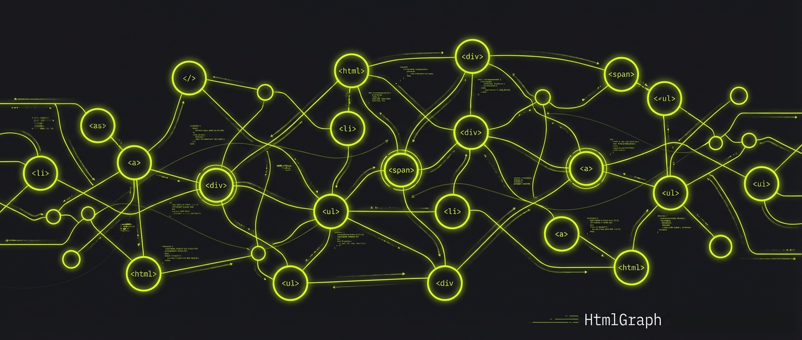

# HTML is All You Need

<div class="hero-subtitle" style="text-align: center; margin: 2rem 0 3rem; font-size: 1.5rem; font-weight: 300; letter-spacing: 0.02em;">
A lightweight graph database framework built entirely on web standards
</div>

<div style="text-align: center; margin: 2rem 0;">

</div>

<div class="quick-start">

## Install HtmlGraph

```bash
pip install htmlgraph
```

## Create Your First Graph

```python
from htmlgraph import SDK

# Initialize SDK (auto-discovers .htmlgraph directory)
sdk = SDK(agent="claude")

# Create a feature with fluent API
feature = sdk.features.create("User Authentication") \
    .set_priority("high") \
    .add_steps([
        "Create login endpoint",
        "Add JWT middleware",
        "Write tests"
    ]) \
    .save()

# Query with filters
high_priority = sdk.features.where(status="todo", priority="high")

# Create tracks with specs and plans
track = sdk.tracks.builder() \
    .title("OAuth Integration") \
    .with_spec(overview="Add OAuth 2.0 support") \
    .with_plan_phases([
        ("Phase 1", ["Setup OAuth (2h)", "Add JWT (3h)"])
    ]) \
    .create()
```

</div>

<div class="feature-grid">

<div class="feature-card">
<span class="feature-icon">&lt;/&gt;</span>
<div class="feature-title">Web Standards Foundation</div>
<div class="feature-desc">
HTML files as nodes, hyperlinks as edges. No external database servers, no JVM. Canonical state is always plain text on disk.
</div>
</div>

<div class="feature-card">
<span class="feature-icon">&#128065;</span>
<div class="feature-title">Human Readable</div>
<div class="feature-desc">
Open any node in a browser. View relationships visually. Git diffs work perfectly. Inspect and debug with DevTools.
</div>
</div>

<div class="feature-card">
<span class="feature-icon">&#9889;</span>
<div class="feature-title">Minimal Infrastructure</div>
<div class="feature-desc">
No external database servers or JVM. HTML and JSONL files are fully offline. SQLite provides fast local queries. Live dashboard via <code>htmlgraph serve</code>.
</div>
</div>

<div class="feature-card">
<span class="feature-icon">&#128226;</span>
<div class="feature-title">AI Agent First</div>
<div class="feature-desc">
Fluent SDK for Claude, Codex, Gemini. Automatic session tracking. TrackBuilder for deterministic workflows.
</div>
</div>

<div class="feature-card">
<span class="feature-icon">&#128200;</span>
<div class="feature-title">Git Native</div>
<div class="feature-desc">
Text-based storage means perfect version control. Diffs show what changed. Merge conflicts are human-readable.
</div>
</div>

<div class="feature-card">
<span class="feature-icon">&#128640;</span>
<div class="feature-title">Production Ready</div>
<div class="feature-desc">
Pydantic validation. SQLite index for scale. Built-in dashboard. Session management. Event tracking. Type safe.
</div>
</div>

</div>

---

## Why HtmlGraph?

Modern AI agent systems are drowning in complexity:

- ❌ **Neo4j/Memgraph**: Docker, JVM, learn Cypher
- ❌ **Redis**: Caching and state management overhead
- ❌ **PostgreSQL**: Heavy relational database setup
- ❌ **Custom Protocols**: Proprietary agent coordination
- ❌ **Separate UIs**: Additional observability tools

**HtmlGraph eliminates all of this.** The web is already a graph database. Use it.

---

## Core Philosophy

!!! quote "The Web is the Graph"
    Every webpage is a node. Every hyperlink is an edge. Every browser is a graph viewer. Version control works. Humans can read it. Agents can navigate it. SQLite indexes it. **HTML is where it all starts.**

---

## Quick Comparisons

### vs Neo4j

| Feature | Neo4j | HtmlGraph |
|---------|-------|-----------|
| Setup | Docker, JVM, learn Cypher | `pip install htmlgraph` |
| Human readable | ❌ Browser required | ✅ Any web browser |
| Version control | ❌ Binary dumps | ✅ Git diff works |
| Query language | Cypher (learn it) | SQLite SQL / Python SDK |
| Cost | $$$ Enterprise | Free, MIT license |

### vs JSON/YAML

| Feature | JSON | HtmlGraph |
|---------|------|-----------|
| Human readable | 🟡 Text editor | ✅ Browser with styling |
| Graph structure | ❌ Manual references | ✅ Native hyperlinks |
| Query | ❌ jq or custom | ✅ SQLite SQL / Python SDK |
| Presentation | ❌ Needs UI | ✅ Built-in rendering |

---

## Next Steps

<div class="feature-grid">

<div class="feature-card">
<div class="feature-title">📚 Get Started</div>
<div class="feature-desc">
<a href="getting-started/">Installation guide, first graph, and core concepts →</a>
</div>
</div>

<div class="feature-card">
<div class="feature-title">🔌 SDK Reference</div>
<div class="feature-desc">
<a href="api/sdk/">Complete SDK documentation with examples →</a>
</div>
</div>

<div class="feature-card">
<div class="feature-title">📖 User Guide</div>
<div class="feature-desc">
<a href="guide/concepts/">Learn tracks, features, and session management →</a>
</div>
</div>

<div class="feature-card">
<div class="feature-title">⚡ Examples</div>
<div class="feature-desc">
<a href="examples/">Real-world use cases and code samples →</a>
</div>
</div>

</div>

---

<div style="text-align: center; margin: 4rem 0 2rem; font-size: 0.875rem; color: var(--hg-text-muted);">
<p>Built with web standards. Designed for AI agents. Loved by developers.</p>
<p style="color: var(--hg-accent); font-weight: 600; margin-top: 1rem;">HTML is All You Need</p>
</div>

<script>
// Animated Graph Visualization
(function() {
  const container = document.getElementById('graph-viz');
  if (!container) return;

  const width = container.offsetWidth;
  const height = container.offsetHeight || 400;

  // Create nodes
  const nodes = [];
  const nodeCount = 25;
  for (let i = 0; i < nodeCount; i++) {
    const node = document.createElement('div');
    node.className = 'graph-node';
    node.style.left = Math.random() * (width - 20) + 'px';
    node.style.top = Math.random() * (height - 20) + 'px';
    node.style.animationDelay = Math.random() * 2 + 's';
    container.appendChild(node);
    nodes.push({
      element: node,
      x: parseFloat(node.style.left),
      y: parseFloat(node.style.top)
    });
  }

  // Create edges between nearby nodes
  for (let i = 0; i < nodes.length; i++) {
    for (let j = i + 1; j < nodes.length; j++) {
      const dx = nodes[j].x - nodes[i].x;
      const dy = nodes[j].y - nodes[i].y;
      const distance = Math.sqrt(dx * dx + dy * dy);

      if (distance < 150 && Math.random() > 0.7) {
        const edge = document.createElement('div');
        edge.className = 'graph-edge';
        edge.style.left = nodes[i].x + 6 + 'px';
        edge.style.top = nodes[i].y + 6 + 'px';
        edge.style.width = distance + 'px';
        edge.style.transform = `rotate(${Math.atan2(dy, dx)}rad)`;
        edge.style.animationDelay = Math.random() * 3 + 's';
        container.appendChild(edge);
      }
    }
  }

  // Slowly animate nodes
  setInterval(() => {
    nodes.forEach((node, i) => {
      const x = parseFloat(node.element.style.left);
      const y = parseFloat(node.element.style.top);
      const newX = x + (Math.random() - 0.5) * 2;
      const newY = y + (Math.random() - 0.5) * 2;

      // Boundary check
      if (newX > 0 && newX < width - 20) {
        node.element.style.left = newX + 'px';
        node.x = newX;
      }
      if (newY > 0 && newY < height - 20) {
        node.element.style.top = newY + 'px';
        node.y = newY;
      }
    });
  }, 100);
})();
</script>
